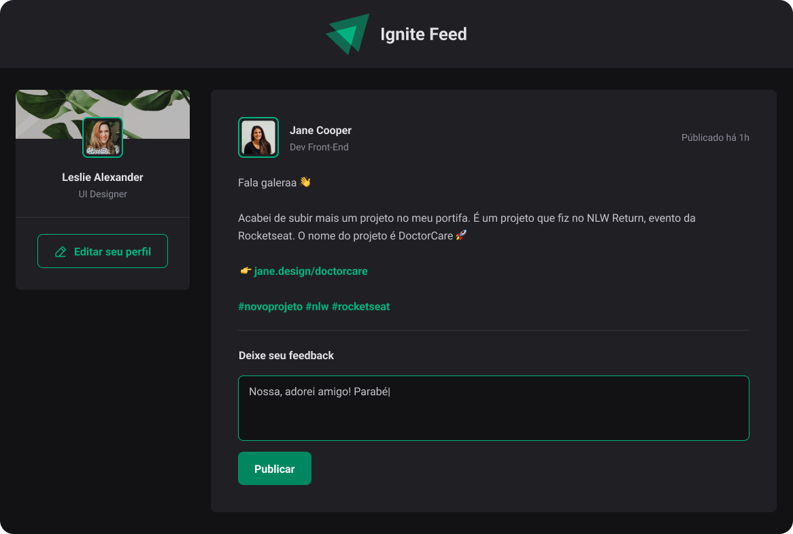

  

 

   App desenvolvido na trilha de ReactJS do Ignite 🚀.

  Na aplicação são abordados os principais conceitos do framework: Componentes, Estados, Propiedades, Eventos 

 

  

 

## ⚡ Stack utilizada

- [ReactJS](https://pt-br.reactjs.org/)
- [Vite](https://vitejs.dev/)
- [Typescript](https://www.typescriptlang.org)
- [CSS-Modules](https://github.com/css-modules/css-modules)
- [Date-fns](https://date-fns.org/)
- [Phosphor-icons](https://phosphoricons.com/)
